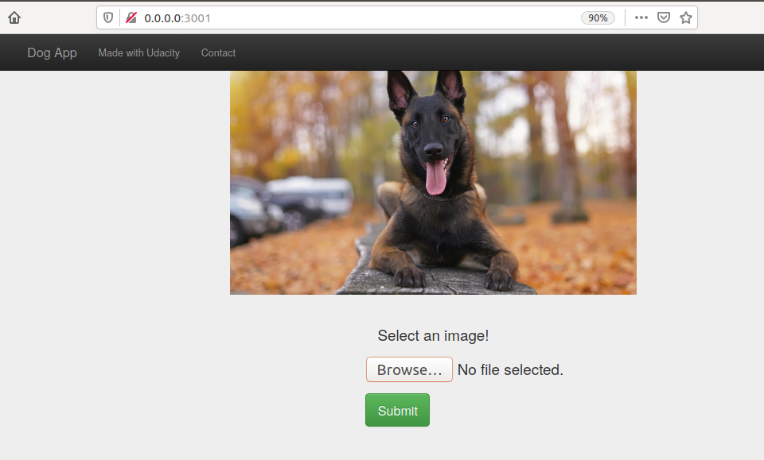
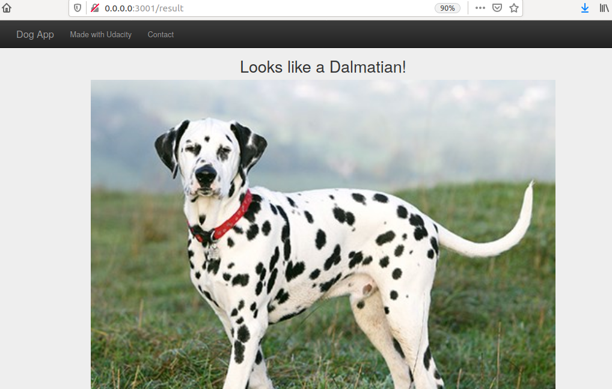

# Dog Breed Detector App Project

## Table of Contents

1. [Installation](#installation)
2. [Running Locally](#local)
3. [Project Definition ](#def)
4. [Analysis ](#analysis)
5. [Methodology](#methodology)
6. [Results](#results)
7. [Conclusion](#conclusion)
8. [File Descriptions](#files)
8. [Acknowledgments](#ack)


## Installation <a name="installation"></a>

This web app has only been tested in python3.6.3. To install, create a python 3.6.3 virtual environment, activate it, and install the dependencies specified in the `requirements.txt` file :

```bash
virtualenv --python=<path to python 3.6.3>  <path to virtualenv/>
source <path to virtualenv>/bin/activate
pip install -r requirements.txt
```

## Running Locally <a name="local"></a>

* To run the app locally, go to the root folder of this app and run:

```bash
python run.py
```

Wait a bit, until the app is deployed. Then go to http://0.0.0.0:3001/

Click in browse and select an image:


     
Wait a bit so that the model performs the prediction, and have fun! `:smiley:`

You can only submit image files with the following extensions: `.jpg, .jpeg, .png, .gif`. Also, there is a limit to the size of the image, so if you can not upload one image, please try with another one.




## Project Definition <a name="def"></a>

### Project Overview

This project aims to create a python flask web application to detect dog breeds from images or photos taken by the user. If the user submits a photo of a human face, the application will return the name of the dog breed that resembles most the human. If the image does not contain a dog nor a human, the app will return a message informing this to the user. This project belongs to the problem domain of machine learning, specifically image classification with convolutional neural networks (CNNs).

The original idea comes from the Udacity's dog breed detector project, and all the code related to the construction of the algorithm used to detect human faces and to classify dog breeds can be found in the dog_app jupyter notebook present in this repository. There is also an HTML version of the notebook, for easier access. 


### Problem Statement

The problem which needs to be solved is to create an algorithm capable of classifying images of dogs according to their breed. Here is the strategy followed to solve this problem:

1. Create a human face detector algorithm
2. Create a dog detector algorithm
3. Create a dog breed classifier algorithm
4. Integrate these algorithms according to the following pseudo-code:
 ```
if the dog detector detects a dog in the image provided by the user
    then use the dog breed classifier to return the name of the dog breed
else if the face detector detects a human face in the image provided by the user
    then use the dog breed classifier to return the name of the dog breed that most resembles the face
else
    return a message explaining that nor a face nor a dog was detected in the image
 ```


### Metrics

In order to measure the performance of our models and detectors, we will be using accuracy as our guideline. Accuracy is the fraction of predictions our model got right, that is to say, the ratio of correct predictions and the total number of predictions.
         
##  Analysis <a name="analysis"></a>

### Data Exploration

As shown in the `dog_app.html` file, the data exploration performed showed that the dog images data set used for this project has the following characteristics: There are 133 total dog categories. There are 8351 total dog images. There are 6680 training dog images. There are 835 validation dog images. There are 836 test dog images

Also, the human images data set used for the project has 13233 total human images.

### Data Visualization

As shown in the `dog_app.html` file, some visualizations were made to show the types of images in the dog and human data sets.

## Methodology <a name="methodology"></a>

### Data Preprocessing

As shown in the `dog_app.html` file, in order to create the face detector, the human faces images had to be preprocessed. The images had to be converted from BGR to a grayscale. Also, the dog images of the dataset had to be preprocessed to feed them to our CNNSs. First, they had to be reshaped to tensors of shape (1, 224, 224, 3). Then, the images had to be normalized, by dividing them by 255.

### Implementation

As shown in the `dog_app.html` file, all the processes for constructing the detectors and the CNNs were documented. Also, the process of getting to the final architectures, and all the complications were documented.

### Refinement

As shown in the `dog_app.html` file, at first we constructed a CNN from scratch, and this approach was interesting, but the extended time of training and the low accuracy of this approach showed that it had to be refined. As a result, we implemented another solution, using transfer learning from a pre-trained RSNET50 CNN, and this approach gave better results.

## Results <a name="results"></a>

### Model Evaluation and Validation

We used accuracy in the first 100 images as our evaluation metric for our face and dog detectors. As shown in the `dog_app.html` file, our human face detector got 100% of correct predictions in the first 100 images. However, the detector detected 11 human images in the first 100 dog images, which is not a desirable output.

Also, our dog detector correctly detected dogs in the first 100 dog images, and it detected no dogs in the first 100 human faces. Finally, our final RESNET50 CNN got an accuracy of 79% in the test data set.


### Justification

As shown in the `dog_app.html` file, the results of the final algorithm were tested in four dog images, in two human photos, and in an image without a face nor a photo. The algorithm performed as expected. The reason why our pre-trained RESNET CNN performed better than our CNN defines from scratch, is that the RESNET50 CNN had more time of training, which translated in higher accuracy. Also, the pre-trained RESNET50 CNN was better in terms of time, because we froze all the pre-trained parameters, and we only had to train some final dense layer to classify our dog images.

## Conclusion <a name="conclusion"></a>

### Reflection

In this project, we aimed to create an app capable of classifying dog breeds from images or photos taken by the user, and of detecting the most similar dog breed to human faces uploaded by the user. We achieved this by creating a face detector, a dog detector, and a CNN for classification of dog images.

One aspect that I found especially interesting was the process of arriving at the final CNN architecture created from scratch. This involved a lot of trial and error, and this helped me to build an intuition about what works better when constructing CNNS. 

One aspect of the project that I found challenging was the process of constructing the flask web application. In particular, I found difficult the process of managing the user uploads with flask.

### Improvement

As shown in the `dog_app.html` file, I think, the final solution could be improved in at least three ways:

1. Increasing the test accuracy of the network extending the training time, or exploring other architectures. Currently, the restnet50 model achieved an 80% accuracy on the testing set. This accuracy could be improved to achieve an accuracy higher than 95%.

2. Decreasing the response time. Currently, the algorithm takes more than 10 seconds to perform the classification. This could be annoying to the user. Maybe it would be good to explore other architectures that take less time running.

3. As reported in question 1, the face detector does not perform very well when analyzing dog images, detecting faces where there are only dogs. Improving the performance of the face detector would increase the overall performance of the algorithm.

## File Descriptions <a name="files"></a>

- `dog_app.ipynb`: a file containing the answered jupyter notebook of the original Udacity's dog project.
- `dog_app.html`: html version of the `dog_app.ipynb` file.
-  `run.py`: python script containing the flask routes for the web app.
- `load_model.py`: python script with function to load our model and make predictions in images.
- `requirements.txt`: specifies the python dependencies of the project.
- `images/`: folder with images for testing
- `models/dog_names.txt`: file with dog breed names
- `models/haarcascade_frontalface_alt.xml`: OpenCV face detector pre-trained model.
- `models/weights.best.ResNet50.hdf5`: weights of our RESNET50 model trained to predict dog breeds.
- `models/DogResnet50Data.npz`: bottleneck features of RESNET50 model.
- `static/`: folder with static resources for the web app.
- `templates/`: a folder that contains the HTML jinja2 templates for the web app.
- `uploads/`: folder to save the images uploaded by the user

## Acknowledgments <a name="ack"></a>

- I acknowledge the Udacity's Dog Project notebook for the inspiration to construct this app.
- This article was very useful in the process of constructing the flask web app: https://blog.miguelgrinberg.com/post/handling-file-uploads-with-flask